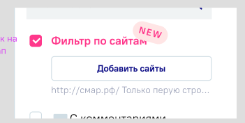
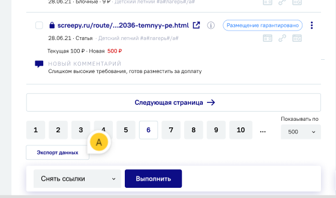
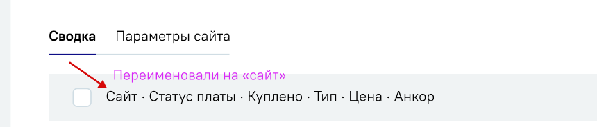

# [Фильтр по сайтам](https://app.asana.com/0/1205600748855900/1208214383141381/f)
Необходимо переработать внешний вид параметра “Отметить ссылки по URLам” в списке ссылок, а также добавить пагинацию на страницу ссылок.

[Макеты](https://www.figma.com/design/21nDQXwQPZktOVv8auqN78/Sape-%C2%B7-Links-List?node-id=2920-16393&t=LDvhnjEiEOyIj10K-4)

1. [Фильтр по сайтам](#title1)  
    - [Как выглядит](#title2)  
    - [Как работает](#title3)  
    - [Use cases](#title4)
    
2. [Пагинация](#title5)
3. [Заменить название](#title6)
    

## <a id="title1"> Фильтр по сайтам </a>

### <a id="title2"> Как выглядит </a>

**На странице ссылок** удаляем текущий параметр “Отметить ссылки по URLам”.
Вместо него в блоке фильтров справа под полем “Текст ссылки” добавляется новый параметр с похожей логикой - “Фильтр по сайтам”.

*Было*

*Стало*

Название параметра - “Фильтр по сайтам” - розового цвета, при наведении становится [более светлым](https://www.google.com/url?q=https://www.figma.com/design/RAMXeZcyoZq7c1WccfsjSz/Sape-%25C2%25B7-Buy_links?node-id%3D4629-83108%26t%3DPV1Goj96ubyKZpz5-1&sa=D&source=docs&ust=1725884450330088&usg=AOvVaw2ndpykIExn2WrAWjpQms2j). Справа отметка “NEW”.  
Название параметра на английском: “Website Filter”  
Название кнопки на английском: “Add websites”

**Тултип для параметра “Фильтр по сайтам” и кнопки “Добавить сайты”:**   
ру: “Используйте этот инструмент для фильтрации ссылок по URL. Чтобы найти ссылки, размещенные на определенных сайтах, нажмите "Добавить сайты" и введите часть URL. Выберите "С начала строки" для поиска ссылок, начинающихся с введенного текста, или "Любое вхождение" для поиска по любому вхождению URL. Нажмите "Отфильтровать" для применения фильтра.”  
en: “Use this tool to filter backlinks by URL. To find backlinks from specific a website, click "Add websites" and enter part of the URL. Select "From start of line" to search for backlinks starting with input text, or "Any entry" to search for any URL entry. Click "Filter" to apply the filter.”

Чек-бокс слева от названия в состоянии Выбран также розового цвета.

Под названием параметра кнопка “Добавить сайты” - белого цвета, текст внутри синий. При наведении текст и границы кнопки становятся голубыми.

### <a id="title3"> Как работает </a>

**По умолчанию чек-бокс не выбран, кнопка “Добавить сайты” активна независимо от того, добавлены ли значения в попап.**  
Если значения не добавлены, то после выбора чек-бокса автоматически открывается попап для ввода сайтов.

По клику на кнопку “Сохранить” попап закрывается, введенные значения отображаются в нем при последующих переходах в попап по кнопке “Добавить сайты”.   
Первое из значений попапа отображается в виде текста серого цвета под кнопкой “Добавить сайты”.

После добавления значений в попап и клика по кнопке “Отфильтровать” ссылки в списке отфильтровываются в зависимости от введенных значений: по соответствию в начале ссылки или по любому вхождению.

Выбран чек-бокс “Фильтр по сайтам”, под кнопкой “Добавить сайты” первая строка из попапа.  

Если подходящих ссылок не найдено, показываем стандартное состояние для “нет результатов”:  

Новый попап для ввода URLов: значения вводятся в поле (1) под заголовком “Фильтр по сайтам”. 
В поле плейсхолдер “Введите URL размещения” - исчезает, если начать вводить значение.  
Плейсхолдер на английском: “Enter the placement URL”.

Под полем ввода две опции для фильтрации (2) - “С начала строки” и “Любое вхождение”. При выборе опции радио-кнопка слева от нее переключается в положение Выбрана. **По умолчанию установлена опция “С начала строки”.**

Если текст введен без протокола, при выборе опции “С начала строки” фильтрация ссылок происходит без учета протокола.  
Если протокол присутствует, то при фильтрации он учитывается - [см. раздел с кейсами](#title4).

Под опциями фильтрации кнопка “Сохранить” (3) - синего цвета, текст белый, при наведении кнопка становится голубой. 
Кнопка “Сохранить” - “Save”  
По клику на кнопку **введенные значения и выбранная опция сохраняются, попап закрывается.** При следующем открытии сохраненные значения остаются в попапе.  

Если в попап не добавлены или удалены ранее добавленные значения, кнопка фильтрации активна, но при попытке отфильтровать ссылки чек-бокс сбрасывается, страница обновляется без применения фильтра по URLам.

Если закрыть попап без сохранения, все изменения сбрасываются, при следующем открытии отображаются старые значения.

### <a id="title4"> Use cases </a>

| Условие     | Кейс                                                                                                                                                                                                                                                                                                                                                                                                                                                                                                                                                                                                                                                                                                                                                                                                                                                                                                                                                                                                 |
|-------------|------------------------------------------------------------------------------------------------------------------------------------------------------------------------------------------------------------------------------------------------------------------------------------------------------------------------------------------------------------------------------------------------------------------------------------------------------------------------------------------------------------------------------------------------------------------------------------------------------------------------------------------------------------------------------------------------------------------------------------------------------------------------------------------------------------------------------------------------------------------------------------------------------------------------------------------------------------------------------------------------------|
| Текстов нет | Выбрать чек-бокс Откроется попап - ввести URLы, сохранить Отфильтровать Ссылки отфильтрованы  Выбрать чек-бокс Откроется попап - закрыть Отфильтровать Страница обновляется, чек-бокс сбрасывается  Выбрать чек-бокс Откроется попап - начать вводить URLы Закрыть без сохранения При повторном открытии попап пустой  Выбрать чек-бокс Откроется попап - ввести url без протокола, напр. sape.ru Выбрать опцию “С начала строки” Сохранить Отфильтровать В результатах поиска ссылки “sape.ru…”, “https://sape.ru…”, протокол не учитывается  Выбрать чек-бокс Откроется попап - ввести url с протоколом, напр. “https://sape.ru…” Выбрать опцию “С начала строки” Сохранить Отфильтровать В результатах поиска ссылки “https://sape.ru…”, протокол учитывается  Чек-бокс не выбран Кликнуть “Добавить сайты” Ввести в попап URLы, сохранить Введенные значения отображаются при следующем открытии |
| Тексты есть | Выбрать чек-бокс Отфильтровать Ссылки отфильтрованы  Выбрать чек-бокс Открыть попап Удалить URLы, сохранить Отфильтровать Страница обновится, чек-бокс сбросится                                                                                                                                                                                                                                                                                                                                                                                                                                                                                                                                                                                                                                                                                                                                                                                                             |

## <a id="title5"> Пагинация </a>
Добавляется на страницу вместо кнопки “Показать еще 50”.  
По умолчанию выбрано “Показывать по 50”, максимальное количество ссылок на странице - 500.

Кнопка экспорта находится под пагинацией.

При применении любого фильтра сортировка происходит, учитывая все ссылки на всех страницах пагинации, а не только на видимой.  

## <a id="title6"> Заменить названия </a>
В таблице ссылок меняем название колонки “URL донора” на “Сайт”:  

